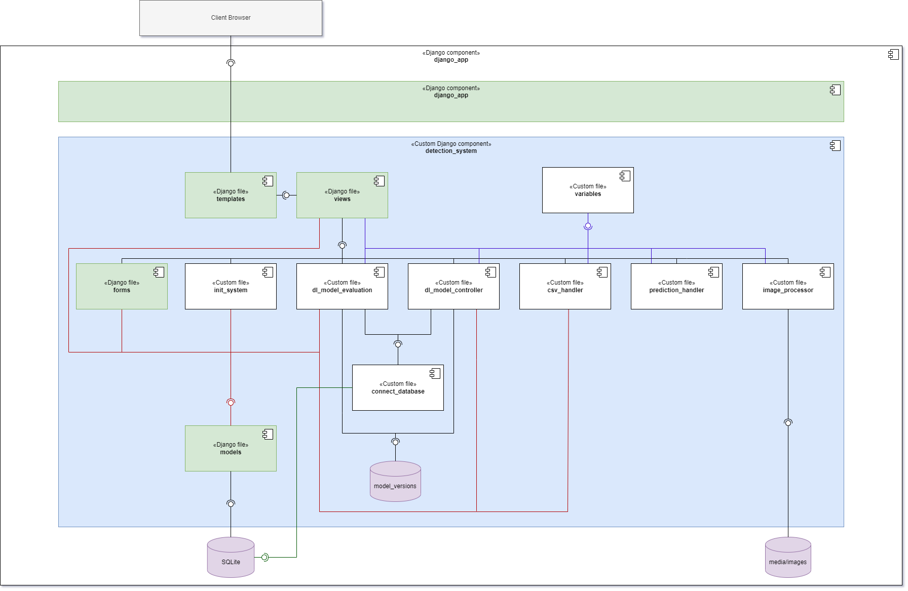
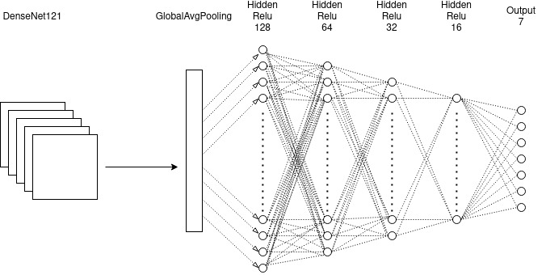
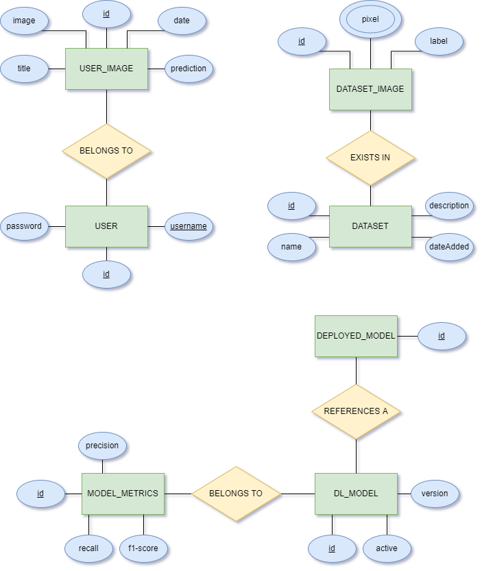

# Skin Cancer Detector

# Table of contents
1. [Purpose](#purpose)
    1. [What](#what)
    2. [Why](#why)
    3. [How](#how)
    4. [Team Resources](#team resources)
2. [Instructions on how to run the application](#instructions)
3. [System Diagrams](#diagrams)
4. [Developers](#developers)

## Purpose 

### What are you going to make? 
A system that aims to predict the probability of skin cancer types. The system allows the end-users to upload an image to the web-application instead of having to book an appointment to get a first opinion of further
investigation.
### Why will you make it? 
To reduces the effort to check up on potential health issues for the end-user.
Furthermore, it reduces the load on the medical system by avoiding having to physically
examine harmless cases. The University of Gothenburg is currently conducting research on the
topic of using Artificial Intelligence (AI) in order to prioritize patients in the medical system based
on the assessment of their skin abnormalities. This shows that this topic is highly relevant.
### How are you going to make it? 
By using jupyter notebooks and keras, we will pretrain a Convolutional Neural Network (CNN)
model by using transfer learning and base it on DenseNet121.
Then we will develop a site using Python, Django, Javascript and Bootstrap. The end user will be able to upload an image of a skin abnormality 
to the system that will be processed by a the CNN. To make a prediction of what type of skin cancer it is. 
In addition, when dealing with neural networks, the issues of staleness and data-drifting need to be tackled. To evaluate and improve the CNN model’s performance the system will provide the possibility for admin-users to evaluate the model using new data, and to re-train the model when deemed necessary. Here, we identify two types of
users - end-users (potential patients) and admin-users.
## Team Resources 

- [Gitlab board](https://git.chalmers.se/courses/dit825/2021/group04/skin-cancer-detector/-/boards)
- [Decision log](https://docs.google.com/spreadsheets/d/1ERCm5GW5aV38Wx8KRvXklGBuB1nU8PjljMNyGGqSs1w/edit?usp=sharing)

## Instructions on how to run the application 
**Prerequisists**
- Docker
- Docker compose
- Git

**Run**
1. **Open a terminal and create an empty folder**
2. **Clone the repository inside the folder**  
    Clone with SSH: `git@git.chalmers.se:courses/dit825/2021/group04/skin-cancer-detector.git` 
    Clone with HTTPS: `https://git.chalmers.se/courses/dit825/2021/group04/skin-cancer-detector.git`
3. **Navigate to skin_cancer_detector/django_app** 
    `cd skin_cancer_detector/django_app`
4. **Run Docker Compose to build and run the program** 
    `docker-compose up --build`
5. **Once the application is built it can be accessed on localhost via port [127.0.0.1:8000](http://127.0.0.1:8000/)**

### Local deployment using minikube
**Prerequisists - For Linux**
- Minikube
  - Virtual Box
- kubectl

**Deployment**

1. `eval $(minikube -p minikube docker-env)` points kubernetes to local docker registry
2. `cd` into skin-cancer-detector/django_app (where the Dockerfile is)
3. `docker build -t cancer:latest .` - build the docker image
4. `kubectl apply -f web-persistance.yaml,web-deployment.yaml,web-claim0-persistentvolumeclaim.yaml,web-tcp-service.yaml` - add service, deployment and volume to kubernetes
5. `minikube service web-tcp` - start the application via kubernetes (minikube)

## System Diagrams 

### Component Diagram

### DL Model Architecture Diagram

#### Database Diagram

## Developers 

- [Johann Tammen](https://git.chalmers.se/tammen)
- [Sandra Smoler Eisenberg](https://git.chalmers.se/smolers)
- [Linus Ivarsson](https://git.chalmers.se/ilinus)
- [Linus Åberg](https://git.chalmers.se/linusab)

